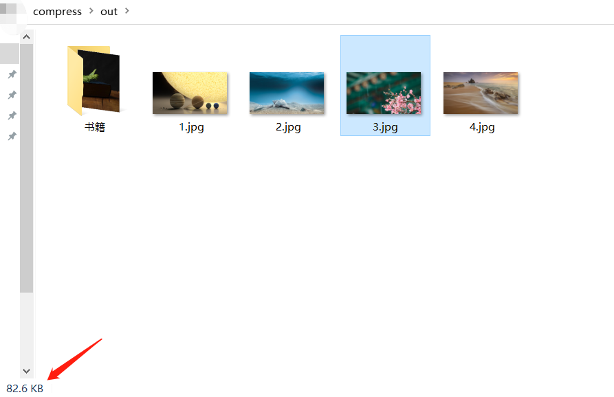
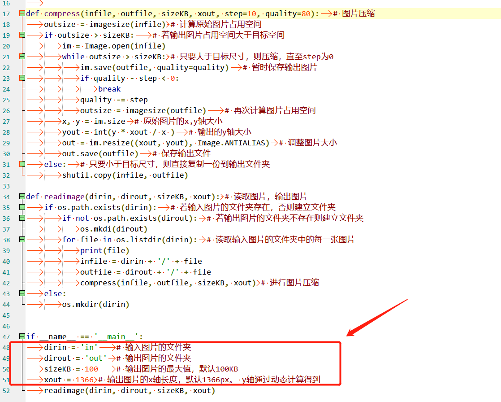
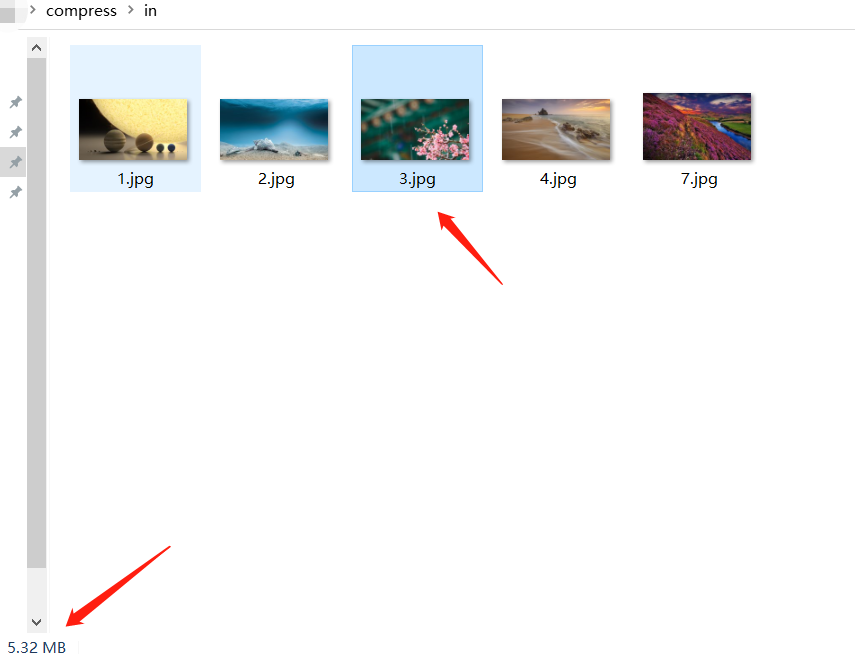
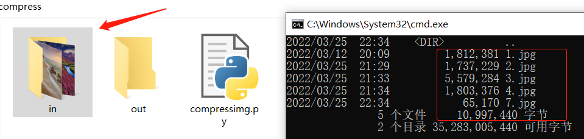
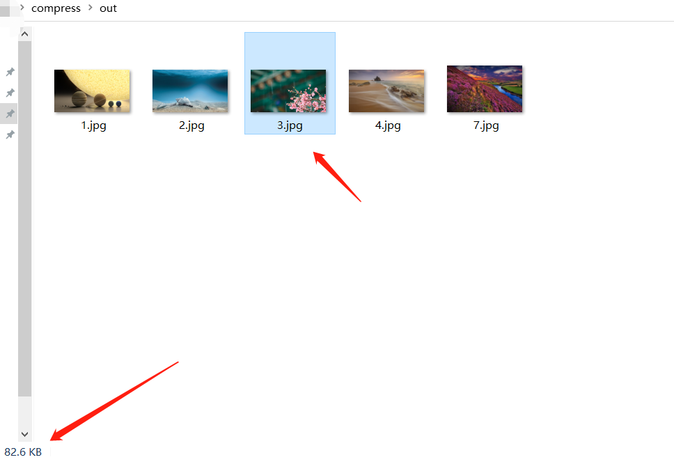
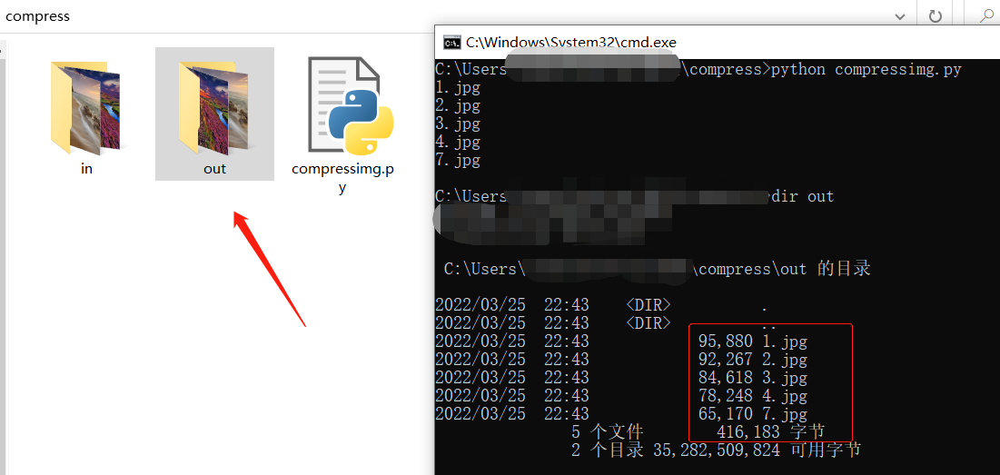

# 批量图片压缩程序
## 简介
有时上传头像时会提示图片尺寸过大导致上传失败，而本款软件能解决此类问题。  
能够批量将in文件夹内的图片压缩，并存放到out文件夹中。  
可自定义一些压缩参数，已有示例图片可供测试。  

## 简单展示 v1.1.0	（增添可压缩多级目录下的图片）
如下图是运行压缩图片程序前的效果  
  

如下图是运行压缩图片程序后的效果  
  

## python运行
运行压缩图片程序的命令  
```
python compressimg.py
```

## 可自定义参数
这些可以在main函数中自定义  
dirin = 'in'	# 输入图片的文件夹。这里是放准备压缩的图片，默认文件夹名称为in  
dirout = 'out'	# 输出图片的文件夹。这里会存放压缩好的图片，默认文件夹名称为out  
sizeKB = 100	# 输出图片的最大值，默认100KB。压缩好的图片尺寸不会超过100KB  
xout = 1366	# 输出图片的x轴长度，默认1366px，y轴通过动态计算得到。  


## 简单展示 v1.0.0
如下图是运行压缩图片程序前的效果  
  
  

如下图是运行压缩图片程序后的效果  
  
  

